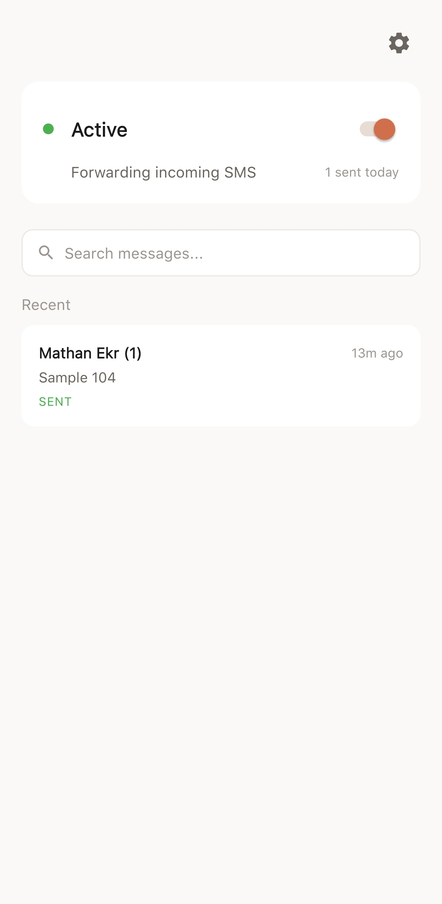
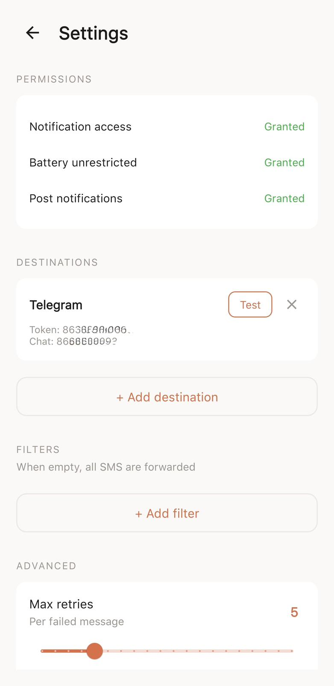
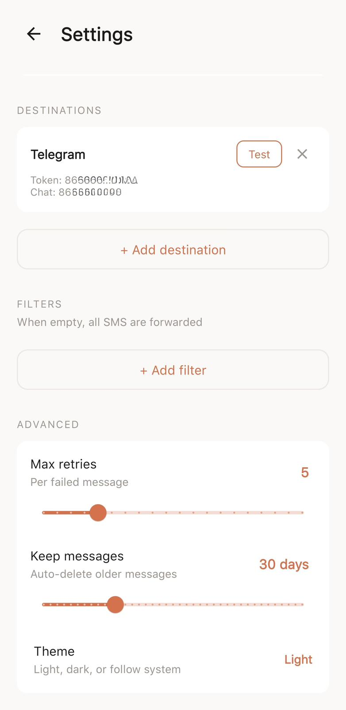

<h1 align="center">SMS Forward</h1>

<p align="center">
  Forward SMS & RCS messages from your Android phone to Telegram, Ntfy, or any Webhook.
</p>

<p align="center">
  <a href="LICENSE"></a>
  <a href="../../releases/latest"></a>
  
  
</p>

---

<p align="center">
  <a href="../../releases/latest">
    
  </a>
</p>

## Screenshots

<p align="center">
  
  &nbsp;&nbsp;
  
  &nbsp;&nbsp;
  
</p>

## About

SMS Forward catches incoming SMS and RCS messages on your Android phone and delivers them to Telegram, Ntfy, or any webhook endpoint. Built for dual-SIM users, travelers, and anyone who needs messages from one phone on another — without paying for cross-border SMS.

The app runs silently in the background, survives phone restarts, and handles Samsung's aggressive battery optimization out of the box.

## Features

- **SMS + RCS forwarding** — catches all incoming messages regardless of protocol
- **Multiple destinations** — Telegram, Ntfy, Webhook (add as many as you need)
- **Deduplication** — handles Samsung's duplicate notifications automatically
- **Retry queue** — failed messages retry when internet returns (configurable limit)
- **Failure alerts** — push notification when forwarding permanently fails
- **Message history** — searchable log with configurable retention (7–90 days)
- **Filter rules** — forward all, or only matching sender/keyword
- **Dark mode** — follows system theme, or choose light/dark manually
- **Device identification** — each message shows which device forwarded it
- **Permission health** — settings page shows granted/missing permissions at a glance

## How It Works

```
SMS/RCS arrives on your phone
        │
  NotificationListenerService catches it
        │
  Dedup check (Room DB, 10s window)
        │
  Save to local database (status: pending)
        │
  WorkManager forwards to destinations
        │
  ┌─────┼─────────┐
Telegram  Ntfy  Webhook
```

## Getting Started

### 1. Install

Download the latest APK from [Releases](../../releases/latest) and install it.

> **Samsung users:** After installing, go to Settings → Apps → SMS Forward → three-dot menu → **Allow restricted settings**. This is required for notification access on sideloaded apps.

### 2. Grant Permissions

The app guides you through onboarding on first launch:

1. **Notification access** — required to read incoming messages
2. **Battery unrestricted** — keeps the app running in background

### 3. Add a Destination

Go to Settings → **+ Add destination** → choose Telegram, Ntfy, or Webhook.

#### Telegram setup

1. Message [@BotFather](https://t.me/BotFather) on Telegram → `/newbot` → follow prompts → copy the **bot token**
2. Message [@userinfobot](https://t.me/userinfobot) → it replies with your **chat ID**
3. Send any message to your new bot (required to start the conversation)
4. Enter bot token + chat ID in the app → tap **Test** to verify

#### Ntfy setup

1. Pick a topic name (e.g., `my-sms-forward`)
2. Install the [Ntfy app](https://ntfy.sh) on your receiving device and subscribe to that topic
3. Enter the server URL and topic in the app

#### Webhook setup

Enter any URL that accepts POST requests with JSON body:

```json
{
  "sender": "+91 98765 43210",
  "body": "Your OTP is 482913",
  "timestamp": 1677123456789,
  "device": "samsung SM-S937B"
}
```

### 4. Enable

Slide the toggle on the home screen → forwarding is active.

## Permissions

| Permission | Why |
|------------|-----|
| `POST_NOTIFICATIONS` | Show failure alerts when forwarding fails |
| `INTERNET` | Send messages to configured destinations |
| `ACCESS_NETWORK_STATE` | Queue messages for retry when offline |
| `REQUEST_IGNORE_BATTERY_OPTIMIZATIONS` | Prevent Android from killing the app |
| Notification Listener | Read incoming SMS/RCS notifications (granted via system settings) |

The app does **not** request `READ_SMS`, `RECEIVE_SMS`, or any contact/phone permissions. It only reads notification content.

## Building from Source

### Prerequisites

- JDK 17+
- Android SDK (platform 34)

### Build

```bash
git clone https://github.com/DhilipBinny/Sms-Forward.git
cd Sms-Forward
./gradlew assembleDebug
```

### Release build

Create a `signing.properties` file in the project root:

```properties
storeFile=../your-keystore.jks
storePassword=your-password
keyAlias=your-alias
keyPassword=your-password
```

Then run:

```bash
./gradlew assembleRelease
```

## Tech Stack

| Component | Technology |
|-----------|-----------|
| Language | Kotlin |
| Database | Room |
| Background work | WorkManager |
| HTTP | OkHttp |
| UI | Material Components, ViewBinding |
| Min SDK | 26 (Android 8.0) |
| Target SDK | 34 (Android 14) |

## Architecture

```
app/src/main/java/com/binny/smsforward/
├── SmsForwardApp.kt                 # App initialization, theme
├── data/                            # Room entities, DAOs, database
├── destination/                     # Forwarder interface + implementations
│   ├── TelegramForwarder.kt
│   ├── NtfyForwarder.kt
│   └── WebhookForwarder.kt
├── service/
│   ├── SmsNotificationListener.kt   # Core: catches notifications
│   └── ForwardWorker.kt            # WorkManager: retry + forward
└── ui/
    ├── OnboardingActivity.kt        # First-launch permission flow
    ├── HomeActivity.kt              # Dashboard + message list
    └── SettingsActivity.kt          # Destinations, filters, config
```

## Privacy

SMS Forward processes everything on your device.

- Messages are **only sent to destinations you configure** (Telegram, Ntfy, or your webhook)
- **No analytics, telemetry, or crash reporting**
- **No data is sent to the developer** or any third party
- Message history is stored locally and auto-deleted based on your retention setting
- The app makes network requests only to your configured destination URLs

## Contributing

Bug reports and pull requests are welcome. Please [open an issue](../../issues) before submitting large changes.

## License

[MIT](LICENSE) — use it however you want.
